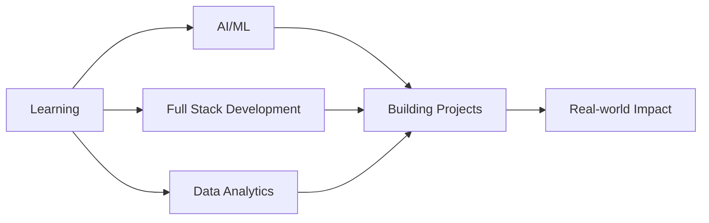
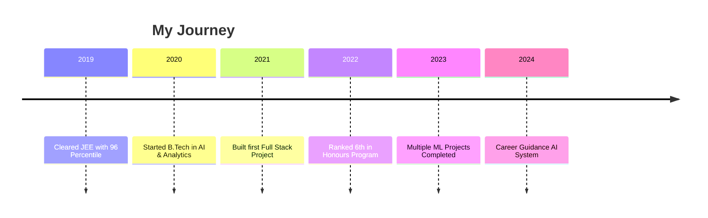

<div align="center">

# 👋 Hi, I'm Ayush Mittal

### 🚀 Web Developer | AI Enthusiast | Problem Solver


[](https://www.linkedin.com/in/ayush-mittal-b25361289/)
[](http://x.com/AyushMittal637)
[](https://ayush-ai-ux.github.io/Portflio_Ayush/)
[](mailto:ayushmittal6377@gmail.com)


</div>

---

## 🚀 About Me

I'm an **entrepreneurial enthusiast**, a dedicated **web developer**, and an **AI & Analytics student** passionate about building innovative, data-driven, and user-centric digital solutions.

```javascript
const ayush = {
    location: "India 🇮🇳",
    education: "B.Tech Honours (AI & Analytics)",
    rank: "6th in Honours Program",
    cpi: 8.4,
    currentFocus: ["AI/ML", "Full Stack Development", "Data Analytics"],
    hobbies: ["Badminton 🏸", "Sketching 🎨", "E-Sports 🎮"],
    funFact: "I merge creativity with technology to solve real-world problems!"
};
```

- 🌐 **Web Developer** crafting impactful digital experiences
- 🤖 Exploring **AI, Machine Learning, and Analytics**
- 🧠 Passionate about **smart systems** that learn and improve over time
- 💡 Love solving **real-world problems** with tech and creativity
- 🎓 **B.Tech Honours (AI & Analytics)** — 6th Rank Holder | CPI: 8.4

---

## 🏆 Academic Highlights

<div align="center">

| 🎓 Milestone | 📊 Achievement |
|--------------|----------------|
| **Class 10** | 96% |
| **Class 11** | 97% |
| **Class 12** | 85% |
| **JEE Mains** | 96 Percentile |
| **JEE Advanced** | Cleared Cutoff ✅ |
</div>

---

## 🛠️ Tech Stack & Skills

<div align="center">

### Frontend Development


### Backend Development


### Databases


### AI/ML & Data Science


### Tools & Platforms


</div>

---

## 📌 Featured Projects

<div align="center">

<table>
  <tr>
    <td width="50%" valign="top">
      <h3 align="center">🔹 Fusion IDE</h3>
      <br />
      <p align="center">
        
        
        
      </p>
      <p align="center">
        A collaborative real-time code editor with compiler integration and live sharing capabilities. Perfect for pair programming and team collaboration.
      </p>
      <p align="center">
        <strong>🔗 Real-time collaboration</strong><br />
        <strong>⚡ Built-in compiler</strong><br />
        <strong>📤 Live code sharing</strong>
      </p>
    </td>
    <td width="50%" valign="top">
      <h3 align="center">🔹 AI Voice Cloning System</h3>
      <br />
      <p align="center">
        
        
        
      </p>
      <p align="center">
        Backend + model integration for converting user-uploaded voice into cloned speech using deep learning techniques.
      </p>
      <p align="center">
        <strong>🎙️ Voice synthesis</strong><br />
        <strong>🤖 Deep learning model</strong><br />
        <strong>🔊 Audio processing</strong>
      </p>
    </td>
  </tr>
  <tr>
    <td width="50%" valign="top">
      <h3 align="center">🔹 Medical AI Assistant</h3>
      <br />
      <p align="center">
        
        
        
      </p>
      <p align="center">
        An ML-powered symptom-based diagnosis helper that assists users in identifying potential health conditions based on symptoms.
      </p>
      <p align="center">
        <strong>🏥 Healthcare AI</strong><br />
        <strong>📊 Predictive analysis</strong><br />
        <strong>💊 Diagnosis assistance</strong>
      </p>
    </td>
    <td width="50%" valign="top">
      <h3 align="center">🔹 Healthcare Platform (MERN)</h3>
      <br />
      <p align="center">
        
        
        
      </p>
      <p align="center">
        Complete mentor-patient platform with booking system, calendar integration, payment processing, and mentoring features.
      </p>
      <p align="center">
        <strong>📅 Appointment booking</strong><br />
        <strong>💳 Payment integration</strong><br />
        <strong>👨‍⚕️ Mentor system</strong>
      </p>
    </td>
  </tr>
  <tr>
    <td width="50%" valign="top">
      <h3 align="center">🔹 Autonomous Vehicle GUI</h3>
      <br />
      <p align="center">
        
        
        
      </p>
      <p align="center">
        A real-time dashboard to fetch and visualize vehicle data using ROS 2 framework with Qt-based GUI for autonomous systems.
      </p>
      <p align="center">
        <strong>🚗 Vehicle data viz</strong><br />
        <strong>📡 Real-time monitoring</strong><br />
        <strong>🎛️ Interactive dashboard</strong>
      </p>
    </td>
    <td width="50%" valign="top">
      <h3 align="center">🔹 Career Guidance Chatbot</h3>
      <br />
      <p align="center">
        
        
        
      </p>
      <p align="center">
        Advanced AI-powered career counseling system with assessments, roadmap generation, goal tracking, and personalized recommendations.
      </p>
      <p align="center">
        <strong>🎯 Career matching</strong><br />
        <strong>📝 Skills assessment</strong><br />
        <strong>🗺️ Roadmap generation</strong>
      </p>
    </td>
  </tr>
</table>

</div>

---

## 📊 GitHub Statistics

<div align="center">


</div>

---

## 🏆 GitHub Trophies

<div align="center">


</div>

---

## 🎯 Current Focus

<div align="center">



</div>

- 🔭 Currently working on **AI-powered career guidance system**
- 🌱 Learning **Advanced Machine Learning** and **Cloud Technologies**
- 👯 Looking to collaborate on **Open Source AI Projects**
- 💬 Ask me about **Web Development, AI/ML, and Entrepreneurship**
- ⚡ Fun fact: **I cleared JEE Advanced cutoff with 96 percentile in JEE Mains!**

---

## 🏸 Beyond Code

<div align="center">

| 🏆 Interest | 💡 Description |
|-------------|----------------|
| **🏸 Badminton** | Smashing serves and volleys |
| **🎨 Sketching** | Creating art when not coding |
| **🎮 E-Sports** | Competitive gaming enthusiast |
| **📚 Learning** | Science & tech content consumer |

</div>

---

## 📈 Contribution Graph

<div align="center">


</div>

---

## 💼 Experience Timeline

<div align="center">



</div>

---

## 🤝 Let's Connect!

<div align="center">

I'm always open to interesting conversations and collaboration opportunities!

[](https://linkedin.com/in/ayushmittal)
[](https://twitter.com/ayushmittal)
[](https://ayushmittal.dev)
[](mailto:ayush@example.com)

### ✨ *"Building the future, one line of code at a time"* ✨

---


</div>
